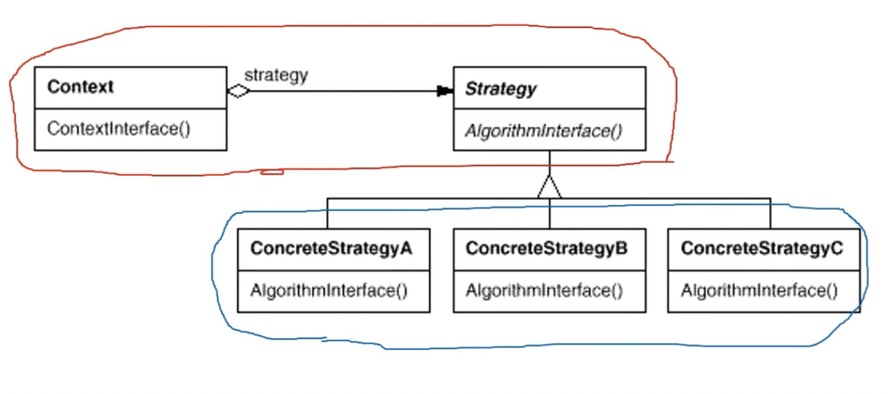

## 动机
* 在软件构建过程中，某些对象使用的算法可能多种多样，经常改变，如果将这些算法都编码到对象中，将会使对象变得异常复杂；而且有时候支持不使用的算法也是一个性能负担。
* 如何在运行时根据需要透明地更改对象的算法？将算法与对象本身解耦，从而避免上述问题？

## 模式定义
* 定义一系列算法，把它们一个个封装起来，并且使它们可互相替换（变化）。该模式使得算法可独立于使用它的客户程序(稳定)而变化（扩展，子类化） 。——《设计模式》 GoF

## 结构


## 要点
* Strategy及其子类为组件提供了一系列可重用的算法，从而可以使得类型在运行时方便地根据需要在各个算法之间进行切换。
* Strategy模式提供了用条件判断语句以外的另一种选择，消除条件判断语句，就是在解耦合。含有许多条件判断语句的代码通常都需要Strategy模式。
* 如果Strategy对象没有实例变量，那么各个上下文可以共享同一个Strategy对象，从而节省对象开销。

## 代码

```cpp
#include <iostream>

using namespace std;

class Strategy {
private:
    /* data */
public:
    virtual void AlgorithmInterface()
    {
        cout << "Defaul algorithm" << endl;
    }
};

class ConcreteStrategyA : public Strategy {
private:
    /* data */
public:
    void AlgorithmInterface()
    {
        cout << "ConcreteStrategyA algorithm" << endl;
    }
};

class ConcreteStrategyB : public Strategy {
private:
    /* data */
public:
    void AlgorithmInterface()
    {
        cout << "ConcreteStrategyB algorithm" << endl;
    }
};

class ConcreteStrategyC : public Strategy {
private:
    /* data */
public:
    void AlgorithmInterface()
    {
        cout << "ConcreteStrategyC algorithm" << endl;
    }
};

class ContextStrategy {
private:
    Strategy* m_strategy;

public:
    ContextStrategy(Strategy* const strategy)
        : m_strategy(strategy)
    {
    }
    ~ContextStrategy()
    {
        delete m_strategy;
    }
    void ContextStrategyInterface()
    {
        m_strategy->AlgorithmInterface();
    }
};

void TestStrategy(void)
{
    ContextStrategy context(new ConcreteStrategyA());
    context.ContextStrategyInterface();
}
```
